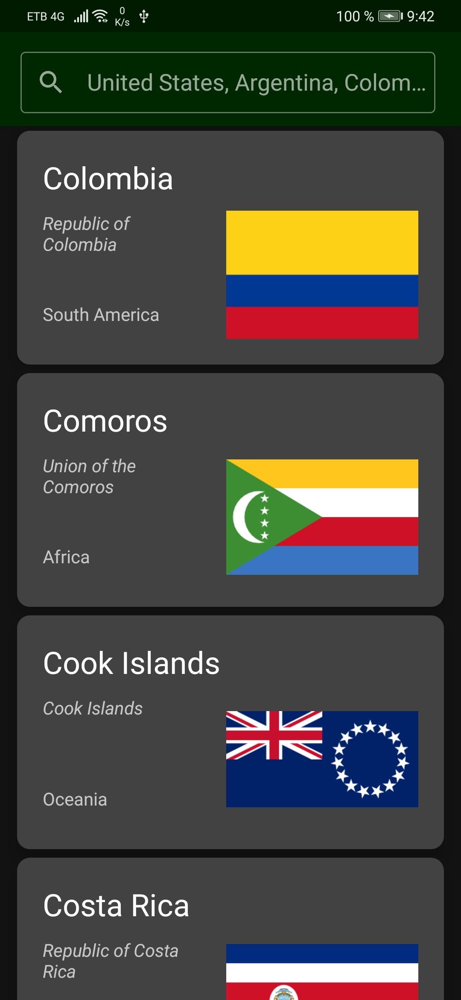
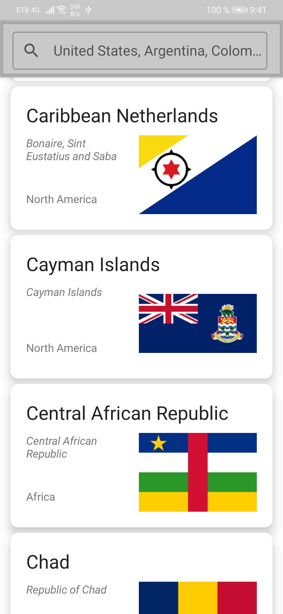
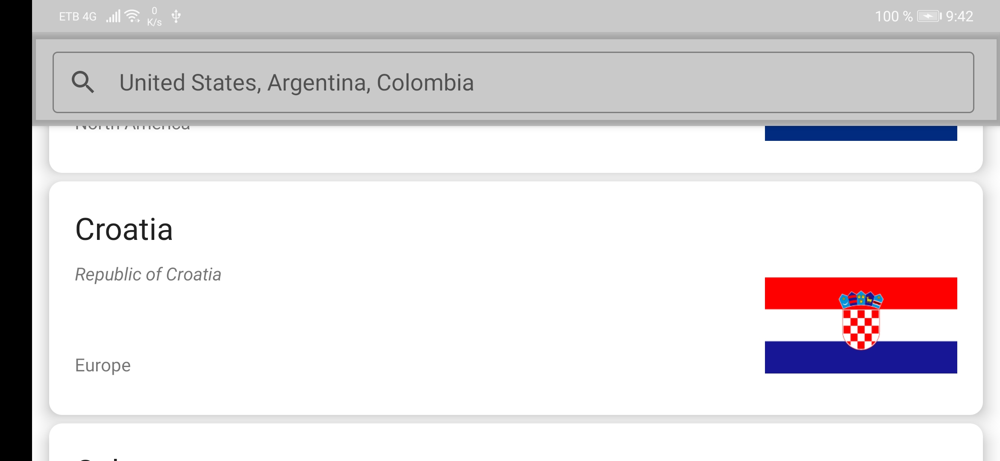

## Libraries ##

- _Hilt_
- _Android navigation_
- _Retrofit_
- _Android navigation_
- _Room_
- _Gson_
- _Lottie_

## APK ##

[APK](https://drive.google.com/file/d/1f6dkYRJ5eEJithFMzpKDrQbETQN7mJGE/view?usp=sharing)

## References ##

[Arquitectura Android](https://github.com/Eli-Fox/LEGO-Catalog)

[Guide to app architecture](https://developer.android.com/jetpack/guide)

[Eli-Fox LEGO ](https://proandroiddev.com/android-architecture-starring-kotlin-coroutines-jetpack-mvvm-room-paging-retrofit-and-dagger-7749b2bae5f7)

[Referencias](https://discover.hubpages.com/technology/Working-With-Android-JetPack-Paging-Library)

## Views ##

1.

2.

